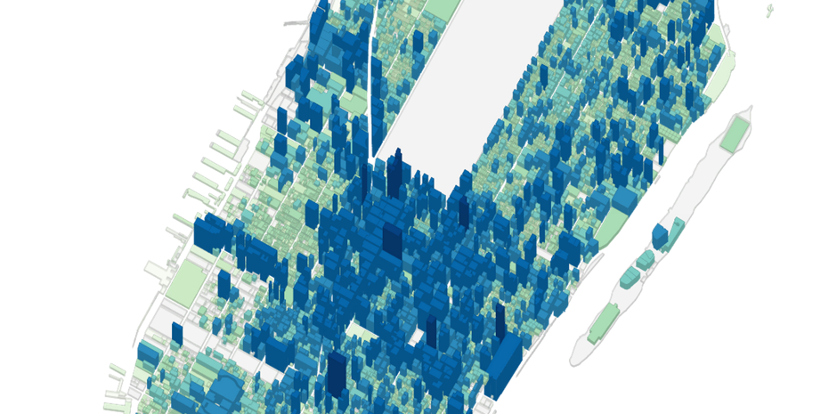
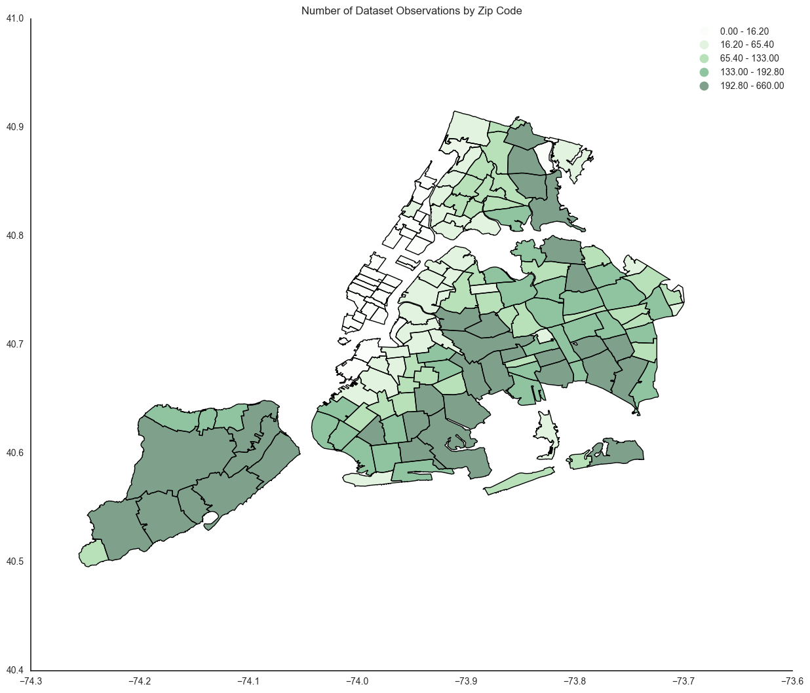
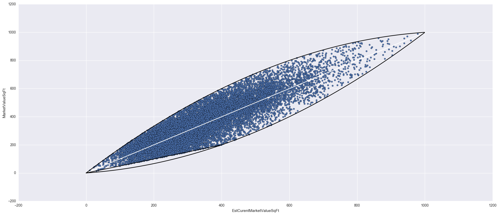
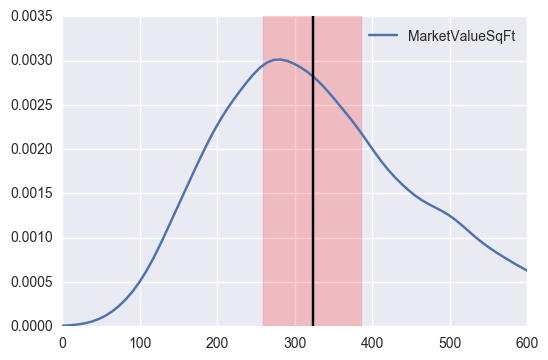

# NYC Building Values

## Background

One of the most hotly requested of the datasets that New York City maintains and releases is PLUTO – short for
“Property Land Use Tax [Lot] Output” – a detailed record of every tract of land and every building standing on it in
New York City. The rows are unique tax lots, and each column describes an attribute — things like property value,
number of buildings on the lot, square footage, and other information useful for tax assessment purposes. The
applications of PLUTO (and its GIS shape-file companion, MapPLUTO) are huge, ranging from demographic studies to
government services mappings to real estate analysis to building age visualizations. We intend to focus on real
estate analysis from the perspective of a land-user, e.g. the perspective of someone looking to own a house,
apartment, or other piece of property in New York City.

The PLUTO dataset does not directly embed any information on price. Luckily we have another data source: the NYC
Department of Finance’s Rolling Sales dataset, which provides a rolling record of all real estate sales by price
which occurred in the last 12 months. By merging this financial data with the PLUTO data we can set ground truths
about the value of specific homes in New York City, using which we can interpolate the values of residential
buildings not in the sales record, and, going one step further, predict the values of future homes to be built in
the city based on their characteristics with respect to the dataset.

This project additionally examines a third dataset, the New York City Department of Finance's RPAD dataset, which
contains information about the government-assessed financial values of units of property in the city. We are
interested in knowing how accurate these estimates are and how they gel when combined with a model based on other
variables.

## Contents

In this project I built a linear regression classifier which ingests variables relating to a building unit (size,
geography, zoning class, and so on) and outputs an estimate of that unit's market value, based on a public-record
history of real estate sales in New York City from within the lats year. The files constituting the project are
contained in `/notebooks`.

## Cleaning

Building a model based on this data ran into two major complexities. The first one is that we are provided with
information about the sale value of a property, which we need to standardize using some metric in order to model
successfully. The obvious metric in this case is market value per square foot. Rolling sales data contains information
about the square footage of the property being sold&mdash;**but it does not provide square footage for apartment
sales**. This makes apartment sales impossible to standardize, and they had to be removed from the dataset entirely.

The second major complexity is that the rolling sales record contains many sales which are not truly "sales", in that
they are either actually 0\$ or nominal-dollar **property transfers** (if you inherit a home from your parents, for
example, it still gets recorded in the property record as technically a sale), *or* they are **non-market sales** for
below-market prices where the rest of the value of the property is made up by some kind of out-of-cash business
contract (an example would be when the city cits an in rem property to a private developer for next-to-nothing in
return for very stingent requirements on what the developer can, cannot, and should do).

Addressing the combination of these concerns required (or rather, it seemed prudent to require) culling out
approximately 25% of non-apartment records in the sales record, in addition to all apartment sales. This resulted in
a dataset footprint that's heavily biased towards lower-value sectors of the outer boroughs:

Data points were confined to a very limited "window" of presumed accuracy, based on their colocation
with the estimated market values assigned in the RPAD data:

This is the data used to build our model.

## Modelling

A simple linear classifier was used. The dataset was modeled in two different configurations: one excluding the
city's value assessment data and one including it. These modeled had r^2 values of ~75% and ~80%, respectively. Here
is a plot of the better of the two model's MSE performance; the band corresponds with one standard deviation worth of
regression error:

Unsurpisingly, most of the variance in the model was explained by geography, with certain effects, like zoning,
having a significantly weaker effect than I had expected. "Scale" variables from the PLUTO dataset describing
properties of the *building*, as opposed to the *property unit* (a building might have many units; a sale might be
for all of them or just for some of them), had next-to-no effect in the model, and could be safely ignored.

The small size of the improvement of the model (5%) when adding in the city's assessment data was very surprising. It
indicates that far more of the variation in price can be explained with simple variables like geography than I had
initially expected, and that, furthermore, the city's value assessments, while containing price information, don't
contain *as much more* of it respective to simple classification as I had expected.

It is unlikely that chosing a different classifier will improve performance (with the possible exception of
geospatial linear regression). This is because basically all of the important variables for the model turned out to
be categorical variables, which are exceptionally well-handled by a linear model; and because the R^2 is already very
high, given the complexity of what we are trying to measure.

While the high r^2 values and fit statistics are encouraging, the extreme lengths we had to go to in order to get data
that we are reasonably sure can be reliably fitted by a model in the first place make it difficult to extend the
model beyond the dataset we generated here. Having apartment sales' square footage data would allow greatly expanding
the "reach" of the model, and working on acquiring that would be a logical next step to take.